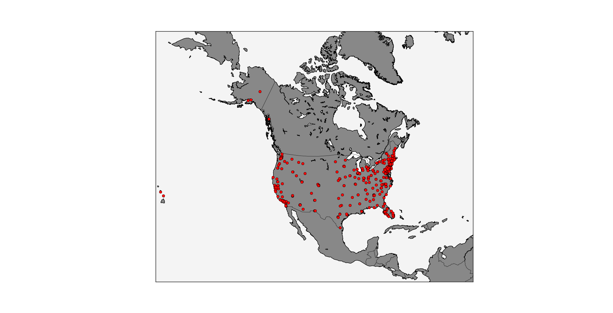
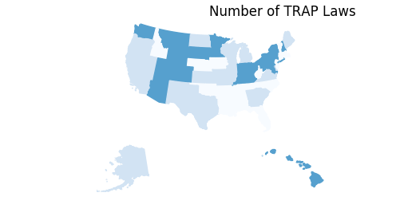
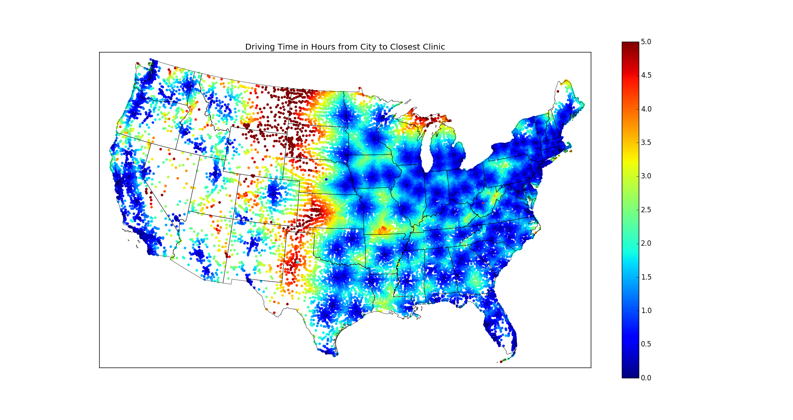
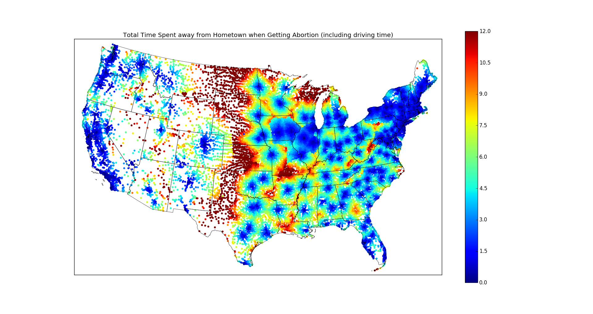
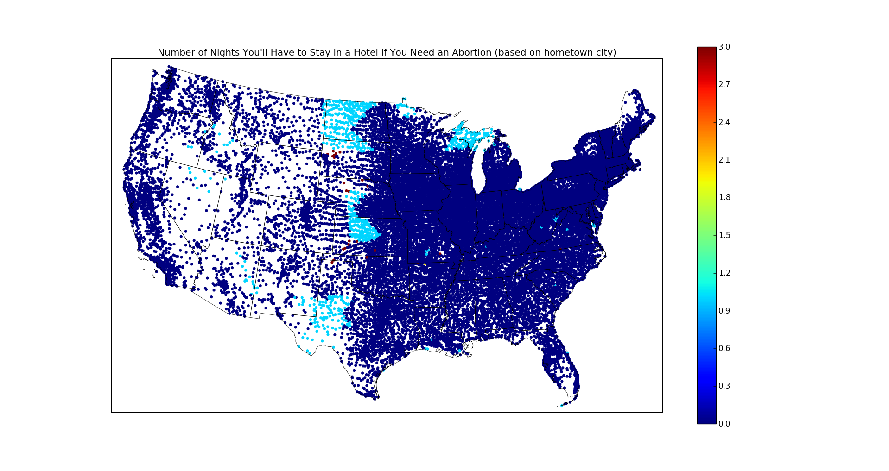
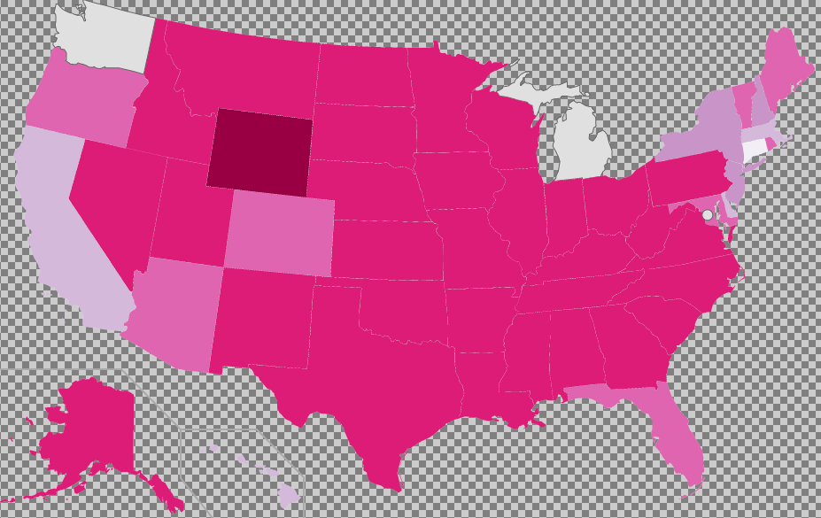
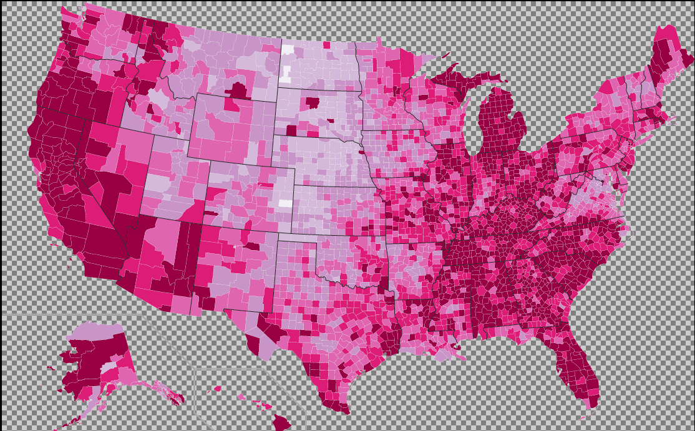

# Mid-Project Checkin

## What We've Accomplished So Far

Getting locations of all abortion clinics in the US

Learned how to plot a state-by-state heatmap by plotting the number of TRAP laws in each state:

Used a dataset that gave us the latitude and longitude location of every US city to find the closest abortion clinic to that city.  We then used Google Maps API to calculate the driving distance from the city to the closest clinic:

We then used the mandated state waiting period for each state (which require a period of 18-72 hours between a counseling session at the clinic and the actual abortion.  Using this data, we determined how much time the patient would actually spend getting the abortion, including such factors as whether they would need to make two separate trips to clinic and whether they would need one more nights’ stay in a nearby hotel, waiting for the procedure.  The following map shows the results of this, mapping the total time spent getting the abortion (note the change in scale when comparing to previous map).

Additionally, based on this data, we calculated how many nights one must spend in a hotel, depending on the state the clinic is located in and how far you drove.  The following chart shows that how many nights you would stay in a hotel, if you lived in that city:

We also got related interesting data sets which may be interested to be plotted with abortion data, like wage, employment, gas info data sets.

Also, found an alternative tool to plot more specific info map. 
The below is the example of the heat map of the percentage of counties without abortion providers in each state.

Example of employment rate in each county heat map. We would reference this info with abortion data later to explore the potential relationships

## Going Forward:

We’ve accomplished collecting data and representing it in Python.  We have a little bit more data analysis to do, in terms of figuring out the cost of gas when traveling to the clinic, and other related costs like the actual cost of abortion.  We already have the cost of hotel, for those cities that need it.

We plan to spend the next week learning d3 so we can represent our data with a javascript webpage.  Ideally, our final product would be a heatmap of the United States colored by city to 
represent the combination of all costs you would spend to get an abortion: in both time and actual money.  Just having this heatmap is our MVP.

Our goal is to make this interactive.  If the user were to hover over a city point, for example, text would pop up to display the specific information for that particular city.  This could take the form of something like:
“If you lived in X city and needed an abortion, you would have to drive A hours to get to the clinic.  The clinic has a mandatory waiting period of B hours, so you would have to spend C nights in a hotel.  You would spend a total of D hours getting the abortion (E hours spent driving), and the total cost in hotel lodging, gas, and cost of abortion would be F dollars.”

Besides the further major manipulating more data sets to  find a better way to calculate and present the cost of having abortion in any given location in America, we may also explore more about the intuitive relationships among abortion data and some other factors, for example population data  vs abortion, (job wage) living cost vs abortion, Unemployment vs abortion. We would even dive deeper into abortion analysis by getting actual abortion frequency data and abortion age data sets. 
